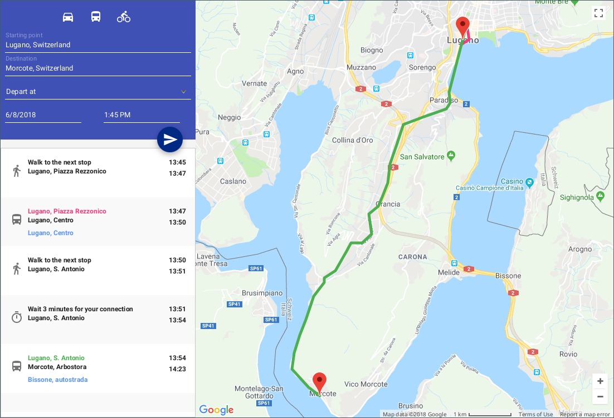
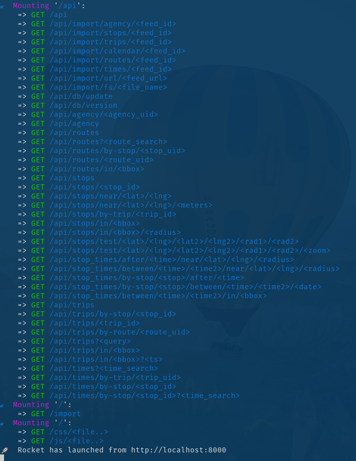
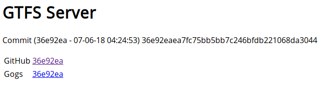
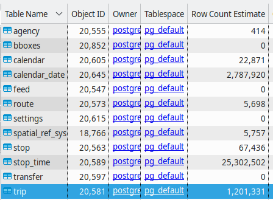
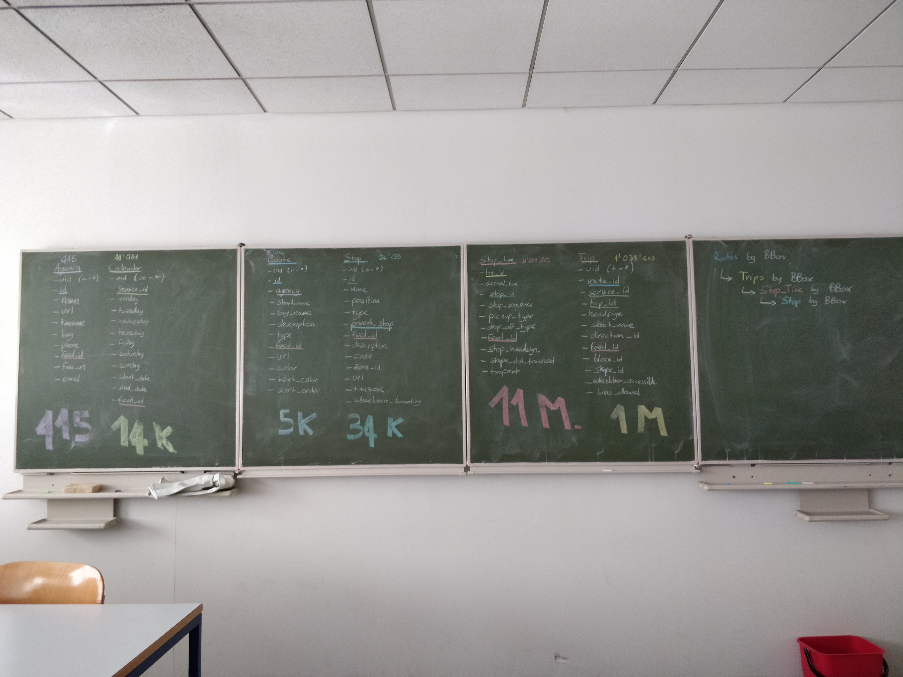
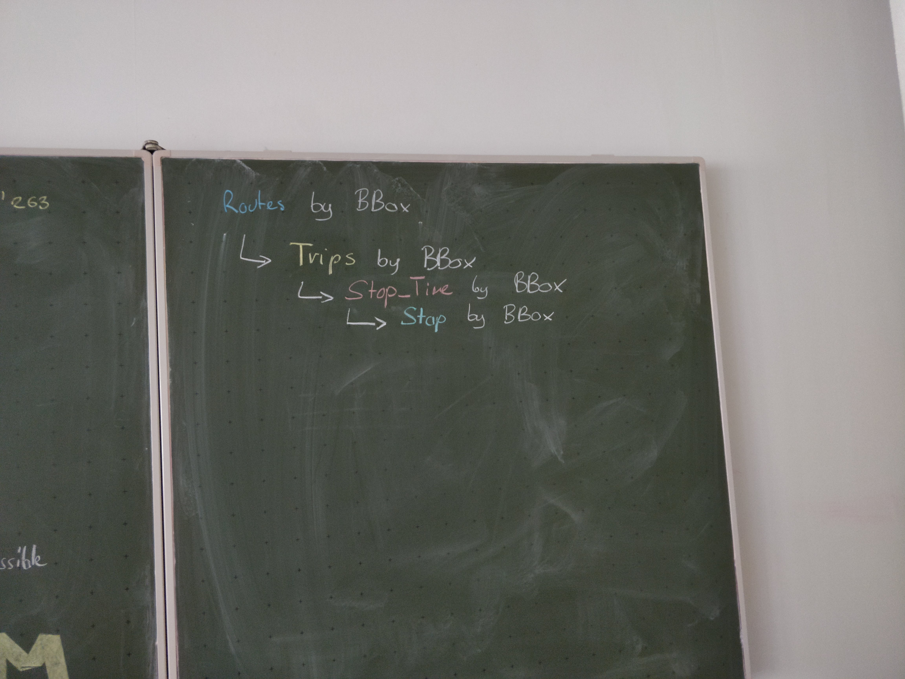
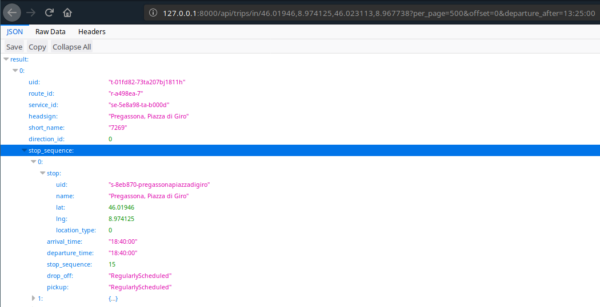

# Opti Travel

<h1 align=center>

</h1>

A journey planner which takes into consideration public transport systems,
bike sharing services and car sharing / car pooling services to find
the best route between a starting and ending point.



## Introduction
This project was developed as a requirement for the course [Software Engineering and Development (C02047)](http://www.supsi.ch/dti/bachelor/ingegneria-informatica/piano-studio-offerta-formativa/offerta-formativa/dettaglio-offerta-formativa/dettaglio-modulo/dettaglio-corso.7052.backLink.5b9811e5-e5e0-4e02-8170-229cb6a7fdcd&m=134464&ps=-1&of=532.html) at [University Of Applied Sciences of Souther Switzerland (SUPSI)](http://supsi.ch/).

### Teacher
- Giambattista Ravano

### Lab Supervisors
- Giancarlo Corti
- Alessandro Trivilini

## Project Requirements
These are the requirements set by our teacher, therefore most of our choices were made to meet the following requirements

- Insert and connect data of carpooling services such as BlaBlaCar, Carticipate, Cariva
- View car sharing options in a certain area / timespan
- Insert or connect data from public transportation services for a certain area
- Insert data for a transport from one point to another, in a certain area
- Compute the travel proposals, including public transportation systems and carpooling.
- ... other requirements to be decided during the lab activities.

### Tools
- StarUML
- IntelliJ
- Java and Java FX

---

Since Java FX is a requirement, we were denied the request of making a web-based application - therefore many of our choices (like the client side routing) were made because of the requirements colliding w/ eachother.

## System Requirements
- Java 8+
- JavaFX
- Gradle

## Preparation

Since the project needs to get some public transportation data and route them locally (because it's part of the requirements) and TransitLand doesn't have updated feeds for the Switzerland area (see [transitland/transitland#296](https://github.com/transitland/transitland/issues/296) for more info about the issue), we had to create and host our own [GTFS Server](https://github.com/denysvitali/gtfs-server) (written in Rust) on [gtfs.ded1.denv.it](https://gtfs.ded1.denv.it/api).

The API wrapper for this service is available [here](https://github.com/denysvitali/optitravel/blob/dev/src/main/ch/supsi/dti/i2b/shrug/optitravel/api/GTFS_rs/GTFSrsWrapper.java).

### Using a remote GTFS server
In order to use a remote GTFS server (default option) the parameter `USE_GTFS_REMOTE` has to be set to `true` in `src/main/ch/supsi/dti/i2b/shrug/optitravel/config/BuildConfig.java`.  
The endpoint is hardcoded [in the wrapper](https://github.com/denysvitali/optitravel/blob/dev/src/main/ch/supsi/dti/i2b/shrug/optitravel/api/GTFS_rs/GTFSrsWrapper.java#L27) and is set by default to `127.0.0.1:8000` for local, and `gtfs.ded1.denv.it:443` for remote, with HTTPS enabled for remote and disabled for local.

### Using a local GTFS server
#### Requirements
- Docker
- Rust (Nightly)

##### Preparation
###### Clone the repository
```
git clone https://github.com/denysvitali/gtfs-server
cd gtfs-server
```

###### Build for release
Running it in development mode (without the `--release` flag) won't add some useful optimizations, the import process for the feeds will be much slower!

```
cargo build --release
```

###### Run the PostGIS Database
```
docker run --name gtfs-server-db --net gtfs-server-net --ip 172.18.0.2 -e POSTGRES_PASSWORD=mysecretpassword -d mdillon/postgis
```

###### Run the server
```
./target/release/gtfs-server
```

If the server starts succesfully, you'll see something similar to the following:



###### Import the required feeds
Once the server is started, you can visit http://127.0.0.1:8000/api, if everything works you'll be greeted with a similar page:


You can now head to http://127.0.0.1:8000/import and import the following feeds:
- Switzerland (SBB) feed: https://opentransportdata.swiss/en/dataset/timetable-2018-gtfs/permalink
- London, UK (TfL) feed: https://denv.it/tfl.zip

If you want more feeds, you can get them from http://transitfeeds.com/.

The import process may take a while, and the PostGIS database may grew to more than 4GB, depending on how many feeds you add, and what's the dataset size.  
In our tests, importing the SBB and TfL feeds resulted in the following:
  
basically, a DB of around 4 GB, with 25M of `stop`s, 2M of `calendar_date`s and 1M of `trip`s. You may now understand why the import process may take this long.  
  
This is why querying for routes in a certain Boudingbox, in a certain timeframe is an intense operation:



we're querying and intersecting 11M + 1M + 5k rows. That's a lot of data. 

---

When the server is up and running, the API is served through the endpoints mentioned in the [server documentation](https://denysvitali.github.io/gtfs-server/), specifically in the [`routes/api` section](https://denysvitali.github.io/gtfs-server/gtfs_server/routes/api/index.html) of the docs.




## Running
The project can be started w/
```
gradle run
```

If you want to avoid querying the remote services and just have a mocked view, you can
change that in `src/main/ch/supsi/dti/i2b/shrug/optitravel/ui/MainController.java` by
setting `mockedPlanner` to `true` and choosing an appropriate pre-calculated trip by setting the

```
File f = new File(getClass().getClassLoader()
         .getResource("classdata/path-9.classdata").getFile());
```
to the appropriate `classdata` file.

## Jenkins builds
Some prebuilt binaries are available on [Jenkins](https://jenkins.ded1.denv.it/job/optitravel/). For example, the development builds are available [here](https://jenkins.ded1.denv.it/job/optitravel/job/dev/).
Download the `optitravel-*-all.jar` and run it with:  
```
java -jar optitravel-*-all.jar
```


## Presentations
These are the project presentations - part of the course grade.

- [Sprint 1](https://docs.google.com/presentation/d/1M1SdM85sgi_bDBK5ziLAEtti44WOVQeW3vpU2qhl_YQ/edit?usp=sharing)
- [Sprint 2](https://docs.google.com/presentation/d/1mot7wuE7-pekUUojp9WQT9Ei2rYCXRxvaFwItSWf8CQ/edit?usp=sharing)
- [Sprint 3](https://docs.google.com/presentation/d/1koeCpqC4YOyagwjAEElK49IW7oFdwXxEcggUxyvvaws/edit?usp=sharing)

## Contributors
- Denys Vitali (GTFS Integration, Routing, Planner)
- Alessandro Ferrari (UI)
- Filippo Pura (TransitLand + Routing)
- Zul Arizal (Logo Design)
